<!--
  ─────────────────────────────────────────────────────────────
   tusharkhan/tusharkhan — GitHub profile README
   The hero, dividers and footer are hand-built SVGs in ./assets
   (theme-aware, no third-party service, so they cannot break).
  ─────────────────────────────────────────────────────────────
-->

<picture>
  <source media="(prefers-color-scheme: dark)"  srcset="assets/hero-dark.svg">
  <source media="(prefers-color-scheme: light)" srcset="assets/hero-light.svg">
  
</picture>

 

 

##  &nbsp;About me

<table>
<tr>
<td width="58%" valign="top">

I'm a **full-stack engineer** based in **Bangladesh**, currently building enterprise
**HR &amp; workforce-attendance platforms** at **Inovace Technologies** — the kind of systems where
a rounding error in an overtime calculation shows up in someone's payslip, so correctness is not
optional.

My depth is in the **PHP / Laravel** ecosystem, in production since 2017.
Most recently I've moved into **NestJS** — building typed, modular services on **Node** and
**TypeScript**, where the dependency-injection and module structure feel like Laravel's discipline
carried onto the Node side. Around that I work across **Go**, **React** and **Java (Spring)** —
whatever the problem actually calls for.

**What I care about**

- 🧩 **Boring architecture that survives** — clear boundaries beat clever abstractions
- 🔍 **Reading code before writing it** — most bugs are already in the repo
- 📦 **Shipping reusable pieces** — three of my packages live on Packagist
- 🔐 **Security as a habit**, not an audit item — currently going deeper on it
- 🌱 **Learning in public** — presently: **NestJS**, **Java internals** &amp; **application security**

</td>
<td width="42%" valign="top">

 

<table>
<tr><td>📍&nbsp; <b>Based in</b></td><td>Bangladesh (UTC+6)</td></tr>
<tr><td>🏢&nbsp; <b>Currently</b></td><td>Inovace Technologies</td></tr>
<tr><td>🧠&nbsp; <b>Core stack</b></td><td>PHP · Laravel · NestJS · Go</td></tr>
<tr><td>🎯&nbsp; <b>Domain</b></td><td>HR, attendance, IoT device fleets</td></tr>
<tr><td>🐙&nbsp; <b>On GitHub since</b></td><td>May 2017</td></tr>
<tr><td>📬&nbsp; <b>Reach me</b></td><td><a href="mailto:tushar.khan0122@gmail.com">Email</a> · <a href="https://www.linkedin.com/in/tushar-khan-18a325b9/">LinkedIn</a></td></tr>
<tr><td>💼&nbsp; <b>Open to</b></td><td>Collaboration &amp; open-source work</td></tr>
</table>

 

> **Ask me about** software architecture, Laravel at scale,
> writing framework-agnostic PHP packages, Go services,
> or migrating a legacy codebase without a rewrite.

</td>
</tr>
</table>

##  &nbsp;Toolkit

<table>
<tr><td valign="top" width="50%">

**Languages**

**Backend &amp; frameworks**

</td><td valign="top" width="50%">

**Frontend**

**Data &amp; infrastructure**

</td></tr>
</table>

##  &nbsp;Featured work

<table>
<tr>
<td width="50%" valign="top">

### 🇧🇩 [Bangla Faker](https://github.com/tusharkhan/banglafaker)

Bangla-language fake-data generator for Laravel — realistic Bengali names, addresses and
phone numbers for seeding and testing.

  

`PHP` · `Laravel` · `Faker`

</td>
<td width="50%" valign="top">

### 🤖 [PHP Chatbot](https://github.com/tusharkhan/chatbot)

Framework-agnostic chatbot engine — drops into plain PHP, Laravel or CodeIgniter and speaks
Web, Telegram and WhatsApp from one set of handlers.

  

`PHP` · `Telegram API` · `WhatsApp`

</td>
</tr>
<tr>
<td width="50%" valign="top">

### 🏗️ [PHP MVC Framework](https://github.com/tusharkhan/PHP-MVC-Framework)

A minimal MVC framework written from scratch — routing, controllers and MySQL support, built to
show what the big frameworks are actually doing underneath.

 

`PHP` · `MVC` · `MySQL`

</td>
<td width="50%" valign="top">

### 📁 [File Database](https://github.com/Soft-Valley/File-database)

A dependency-free database that stores records as JSON files — full CRUD for small apps and
prototypes that shouldn't need a database server.

  

`PHP` · `JSON` · `Zero-dependency`

</td>
</tr>
<tr>
<td width="50%" valign="top">

### 🔐 [Laravel Passport MultiAuth](https://github.com/tusharkhan/Laravel-Passport-MultiAuth)

Multiple authentication guards on top of Laravel Passport — separate token flows for users,
admins and API clients.

 

`PHP` · `Laravel` · `OAuth2`

</td>
<td width="50%" valign="top">

### ✈️ [Air Ticket Booking](https://github.com/tusharkhan/Air-Ticket-Booking-JavaFx-MySql-fxml)

Desktop flight-booking system in JavaFX with FXML views, Material-styled UI and a MySQL
backend — my way into JVM-land.

 

`Java` · `JavaFX` · `MySQL`

</td>
</tr>
</table>

##  &nbsp;By the numbers

<picture>
  <source media="(prefers-color-scheme: dark)"  srcset="https://github-profile-summary-cards.vercel.app/api/cards/profile-details?username=tusharkhan&theme=github_dark">
  <source media="(prefers-color-scheme: light)" srcset="https://github-profile-summary-cards.vercel.app/api/cards/profile-details?username=tusharkhan&theme=default">
  
</picture>

  

<picture>
  <source media="(prefers-color-scheme: dark)"  srcset="https://github-profile-summary-cards.vercel.app/api/cards/repos-per-language?username=tusharkhan&theme=github_dark">
  <source media="(prefers-color-scheme: light)" srcset="https://github-profile-summary-cards.vercel.app/api/cards/repos-per-language?username=tusharkhan&theme=default">
  
</picture>
<picture>
  <source media="(prefers-color-scheme: dark)"  srcset="https://github-profile-summary-cards.vercel.app/api/cards/most-commit-language?username=tusharkhan&theme=github_dark">
  <source media="(prefers-color-scheme: light)" srcset="https://github-profile-summary-cards.vercel.app/api/cards/most-commit-language?username=tusharkhan&theme=default">
  
</picture>

<picture>
  <source media="(prefers-color-scheme: dark)"  srcset="https://github-profile-summary-cards.vercel.app/api/cards/stats?username=tusharkhan&theme=github_dark">
  <source media="(prefers-color-scheme: light)" srcset="https://github-profile-summary-cards.vercel.app/api/cards/stats?username=tusharkhan&theme=default">
  
</picture>
<picture>
  <source media="(prefers-color-scheme: dark)"  srcset="https://github-profile-summary-cards.vercel.app/api/cards/productive-time?username=tusharkhan&theme=github_dark&utcOffset=6">
  <source media="(prefers-color-scheme: light)" srcset="https://github-profile-summary-cards.vercel.app/api/cards/productive-time?username=tusharkhan&theme=default&utcOffset=6">
  
</picture>

  

<picture>
  <source media="(prefers-color-scheme: dark)"  srcset="https://streak-stats.demolab.com?user=tusharkhan&theme=tokyonight&hide_border=true&border_radius=12&date_format=j%20M%5B%20Y%5D">
  <source media="(prefers-color-scheme: light)" srcset="https://streak-stats.demolab.com?user=tusharkhan&theme=default&hide_border=true&border_radius=12&date_format=j%20M%5B%20Y%5D">
  
</picture>

  

<picture>
  <source media="(prefers-color-scheme: dark)"  srcset="https://github-readme-activity-graph.vercel.app/graph?username=tusharkhan&theme=tokyo-night&hide_border=true&radius=12&custom_title=Contribution%20activity%20%E2%80%94%20last%2031%20days">
  <source media="(prefers-color-scheme: light)" srcset="https://github-readme-activity-graph.vercel.app/graph?username=tusharkhan&theme=github-light&hide_border=true&radius=12&custom_title=Contribution%20activity%20%E2%80%94%20last%2031%20days">
  
</picture>

  

<!--
  ── CONTRIBUTION SNAKE ──────────────────────────────────────────────────────
  An animated snake that eats my contribution graph, generated by
  .github/workflows/snake.yml and published to the `output` branch.

  TO ENABLE (one time):
    1. Push this repo, then open the Actions tab and let "Contribution Snake"
       finish (it also runs automatically on every push to main).
    2. Confirm https://github.com/tusharkhan/tusharkhan/tree/output now
       contains snake-dark.svg and snake-light.svg.
    3. Delete this comment's opening and closing markers to show the block.
  ────────────────────────────────────────────────────────────────────────────
<picture>
  <source media="(prefers-color-scheme: dark)"  srcset="https://raw.githubusercontent.com/tusharkhan/tusharkhan/output/snake-dark.svg">
  <source media="(prefers-color-scheme: light)" srcset="https://raw.githubusercontent.com/tusharkhan/tusharkhan/output/snake-light.svg">
  
</picture>
-->

##  &nbsp;Let's talk

I read every message. Whether it's a **collaboration**, a **hard architecture problem**,
a **bug in one of my packages**, or just a hello — the inbox is open.

 

  

